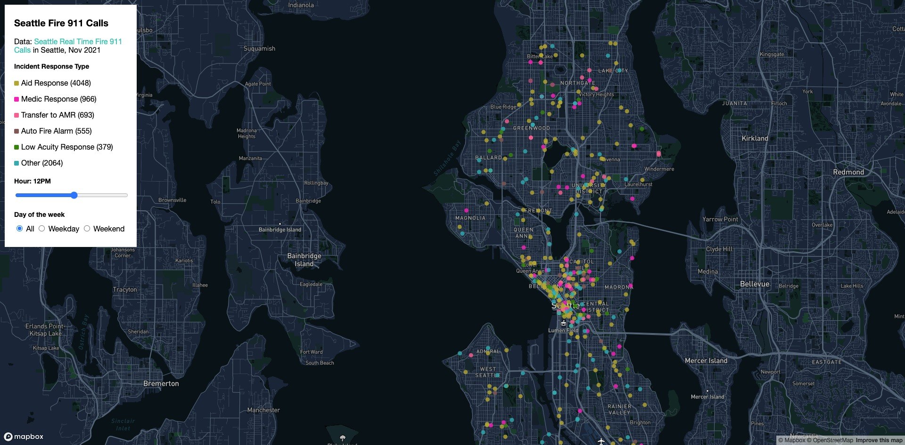
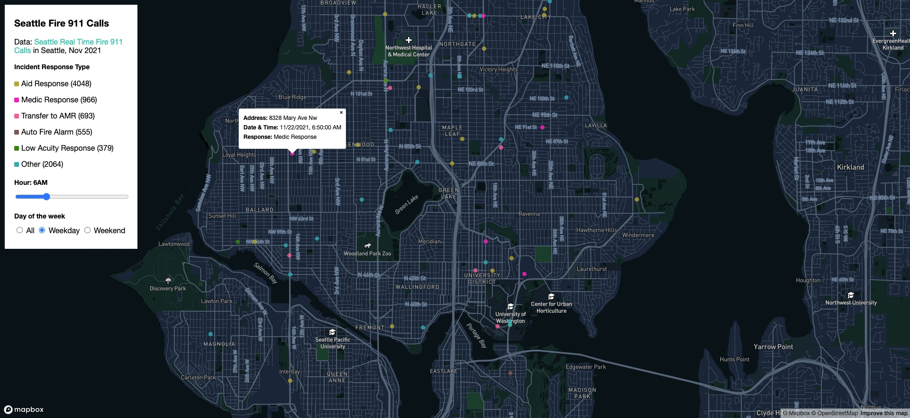

# Seattle Fire 911 Calls

**Application URL:** https://nahomagidew.github.io/geog-495-final-project/

## Description
This project presents a map of "911 calls" made to the Seattle Fire Department in the month of November 2021. The data was sourced from the City of Seattle's Open Data portal which is freely available to the public. My inspiration for the project came from [UW Alert](https://www.washington.edu/safety/alert/). The UW Alert, as its name indicates, is an altering system used to relay message to the University of Washington's students and faculty. These alerts are sent via email, text messages, and website banners. As a student at the UW, I had been getting these alerts regularly, and I have always been curious to analyze the patterns of these emergency situations, and get a sense of how safe the city is and when/where these incidents occur. So a person who has the same curiousity can take advantage of this web application (with some limitations explained below). The exact data aggregated by the university was not easy to acquire, so this project is an attempt to make a similar analysis through a proxy dataset.

The University of Washington's Police Department works closely with the Seattle Police Department, so I am making the assumptions that there is likely a data overlay between the two departments. The dataset used provides realtime Seattle Fire Department 911 dispatches, and it gets updated every 5 minutes. It contains six distinct attributes: the incident's address, response type, date and time of the call, latitude and longitude, and finally, the incident number. As you can imagine, with the frequency the data is being updated and the size of the city, the dataset can be huge. And that was the first challenge I encountered working on this project. The full dataset was close to 1 gigabyte, which will make the map slow, and optimizing that was outside the scope of this assignment. Instead, I chose to narrow it down to the most recent complete month (which is November 2021 as of this writing). So, one limitation of this web application is that it is only displaying one month of data. Therefore, it would not be accurate for an end-user to deduce the general safety of the UW campus or the Seattle area based on a filtered dataset.

Before I discuss the feature details, I wanted to describe the development process of the project. First, I used [Postman](https://www.postman.com/) to make a custom GET query and filter the dataset by month. The response yielded about 8.7k records in JSON format. After downloading the dataset, most of the development time was spent on pre-processing it so that it can easily be digested by the frontend. To do this, I wrote a simple parser Python script. The script did several things such as cleaning incomplete rows (some entries had a massing coordinate for example), calculating hour and day from the call timestamp, and finally exporting to geojson format (remember the original data was in JSON format). The script used built-in Python libraries, so no external packages were necessary to do the pre-processing. After the script did its job, it was a matter of reading that into the frontend.

I created a custom base map using Mapbox Studio as per the requirement. The project heavily relies on Mapbox GL JavaScript library to display the base map and thematic layer including filtering data. The main functionalities include displaying incident locations as color-coded dots by response type, a slider that filters incidents based on time of the call, the ability to select on what day (weekday vs weekend) the incident happened on, and finally, a pop-up that displays additional information for a selected incident. As a user you are able to zoom and pan-around the area, use the slider and radio buttons in the left corner to filter the data you want to see, and click on a particular incident that catches your eye and view details (which can be seen in the screenshot below).

The web application is hosted on Github pages which you can visit here https://nahomagidew.github.io/geog-495-final-project/ (also linked above).

Finally, there are some features I wanted to include, but due to time constraints, I was not able to implement them in time. For instance, the ability to filter by incident response type. This will make it even easier for the user to filter and have a cleaner view. Furthermore, I wanted to add a heat map layer on top of the circle layer similar to this [demo](https://docs.mapbox.com/help/demos/make-a-heatmap-with-mapbox-gl-js/final.html). As the map loads, the user will only see a heat map distribution of incidents, then as they zoom into a particular area of interest, the heat map layer will be replaced with the circle and they can see individual calls. I might be able to expand upon the project and implement those extension in future revisions.

## Data sources
The primary and only data source for this project came from [City of Seattle Open Data](https://data.seattle.gov/Public-Safety/Seattle-Real-Time-Fire-911-Calls/kzjm-xkqj).

## Acknowledgment
I would like to acknowledgment Professor Bo Zhao's work at the University of Washington. This project wouldn't have been possible without the lessons I learned in the GEOG 495 course. The codebase is heavily drawn from [Module 09](https://github.com/jakobzhao/geog495/tree/main/modules/module09) of the course.
